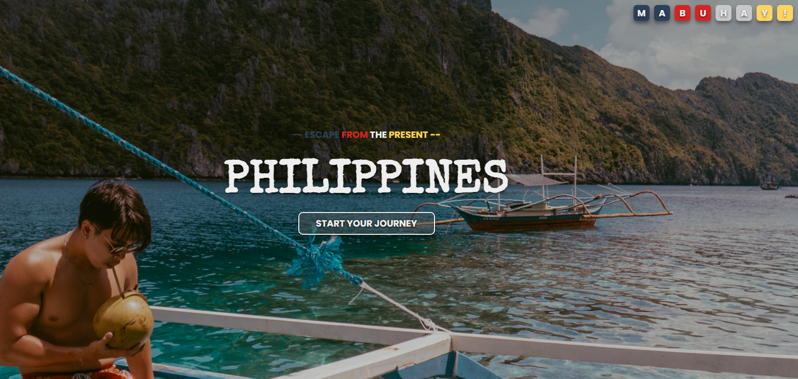

# Travel-Website

> Mock-up Travel website

---

### Table of Contents

Sections headers used to reference location of destination.

- [Demo](#demo)
- [Description](#description)
- [How To Use](#how-to-use-in-your-local-environment)
- [Author Info](#author-info)

---

## Demo

> View demo at: https://jp-ce.github.io/Travel-Website/

---

## Description

A mock-up travel website. Includes a landing page, about, showcase of possible destinations, testimonials, as well as a contact page.

#### Technologies

- Visual Code Studio
- JavaScript
- SASS
- HTML & CSS
- UI/UX
- Responsive

[Back To The Top](#travel-website)

---

## How to use in your local environment

#### Prerequisites

- Clone this repository

#### Installation

- Run in localhost / live server

---

## Author Info

- linkedIn - [@jpev.dev](https://linkedin.com/in/jianneevangelista)
- Website - [jp.ev](https://jpce.netlify.app/)

[Back To The Top](#travel-website)
